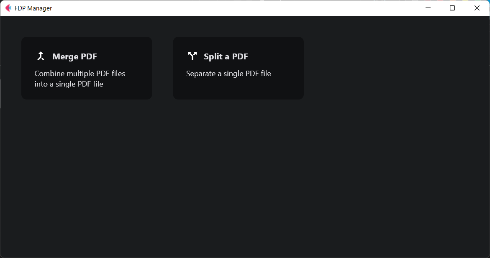
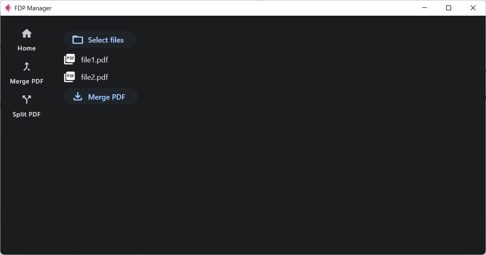
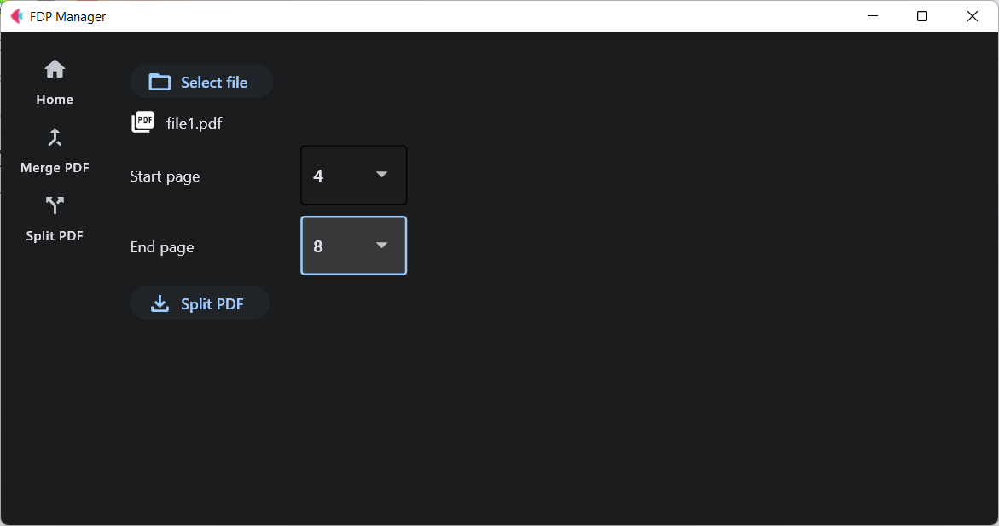

# FDP Manager - PDF File Manager
___

## Table of Contents

- [Introduction](#introduction)
- [Getting Started](#getting-started)
  - [Installation](#installaltion)
  - [Desktop Packaging](#desktop-packaging)
  - [Usage](#usage)
- [License](#license)

___

## Introduction

FDP Manager is an application for managing PDF files. Comes with the feature of merging and splitting PDF files for 
free. With a simple design, you can manage PDF files easily.

___

## Getting Started

## Installation

FDP Manager uses `pipenv` to manage its Python environment and dependencies. Follow these steps to set up the Python 
environment for this project:

1. **Install Pipenv**\
    If you haven't already installed `pipenv`, you can do so with `pip`.

    ```bash
    pip install pipenv
    ```
   
2. **Create the Virtual Environment and Install Dependencies**\
   Run the following command in your project directory to create a virtual environment and install the project's dependencies from the `Pipfile.lock`:

   ```bash
   pipenv install --dev
   ```

3. **Activate the Virtual Environment**\
   To activate the virtual environment, use the following command:

   ```bash
   pipenv shell
   ```

4. **Running the Application**\
   You can now run the FDP Manager applications. Use the following command:

   ```bash
   flet run main.py
   ```

## Desktop Packaging
You can package FDP Manager into Desktop application. According to 
[Flet packaging desktop app](https://flet.dev/docs/guides/python/packaging-desktop-app), to packaging into desktop 
application, use the following command:

```bash
flet pack main.py
```

The result of the packaging is saved in `dist` folder.

## Usage

Currently, FDP Manager has two features, "Merge PDF" and "Split PDF".



### Merge PDF

1. Click on the "Merge PDF" option in the main menu.
2. Add the PDF files you want to merge using the "Select files" button.
3. Select files according to merge order.
4. Click the "Merge PDF" button to start the merging process and save the file.



### Split PDF

1. Click on the "Split PDF" option in the main menu.
2. Add the PDF file you want to split using the "Select file" button.
3. Select the file to be split.
4. Enter the "Start page" and "End page" as the split limit.
5. Click the "Split PDF" button to start the splitting process and save the file.



___

## License

This project is licensed under the MIT License - see the [LICENSE](LICENSE) file for details.